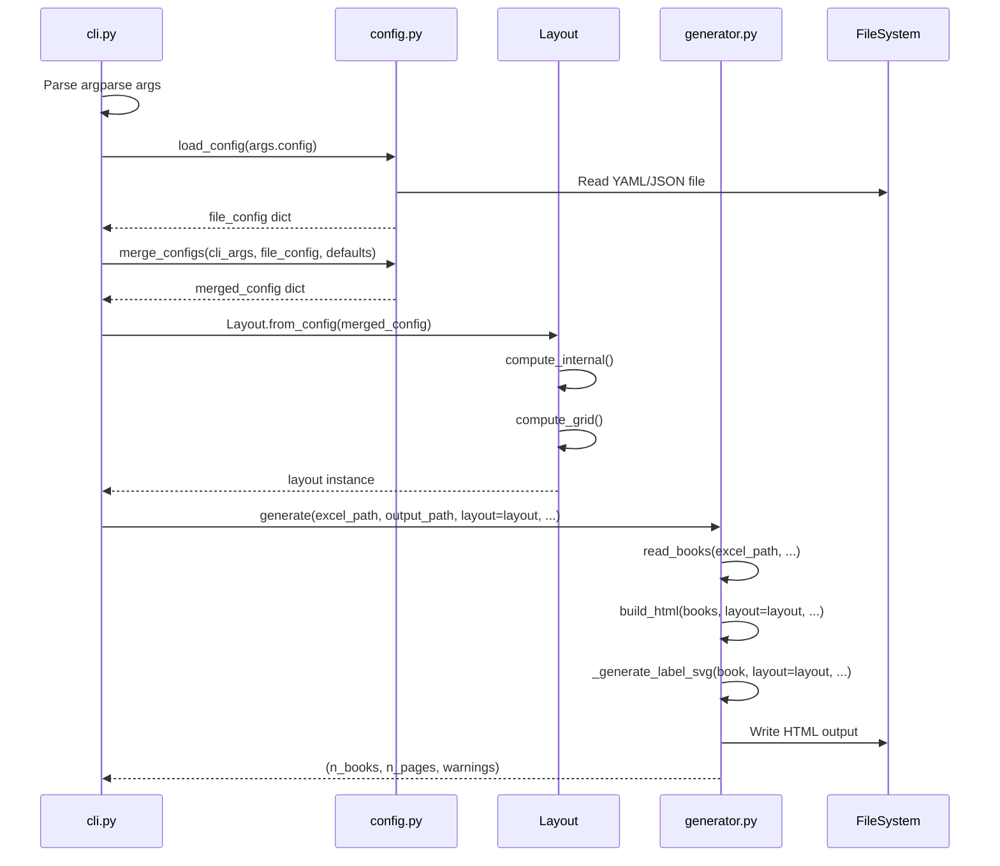
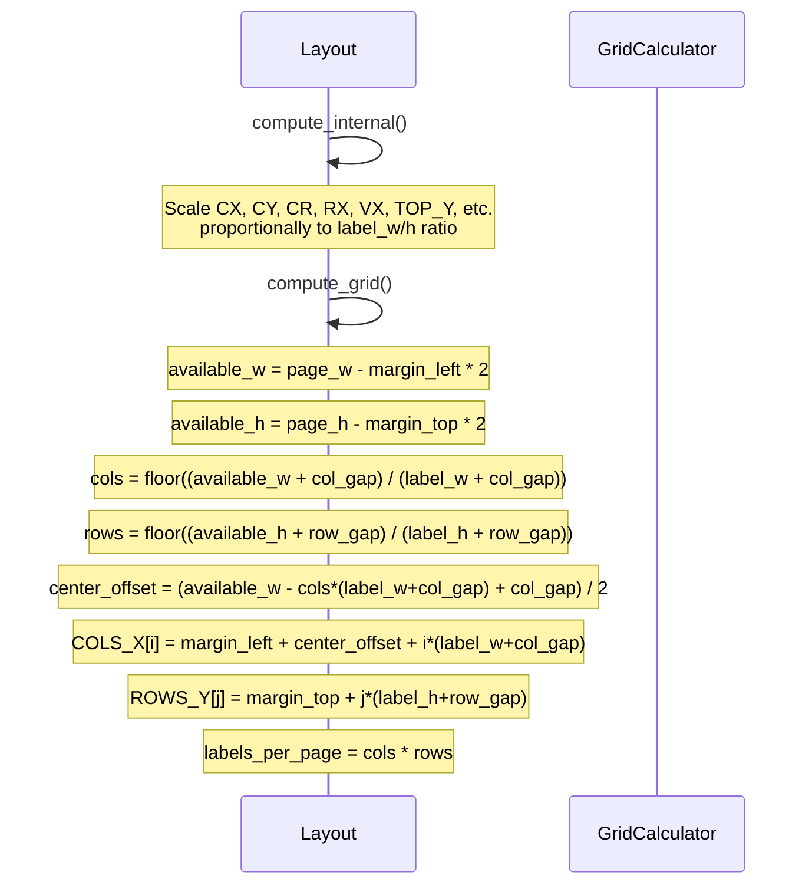
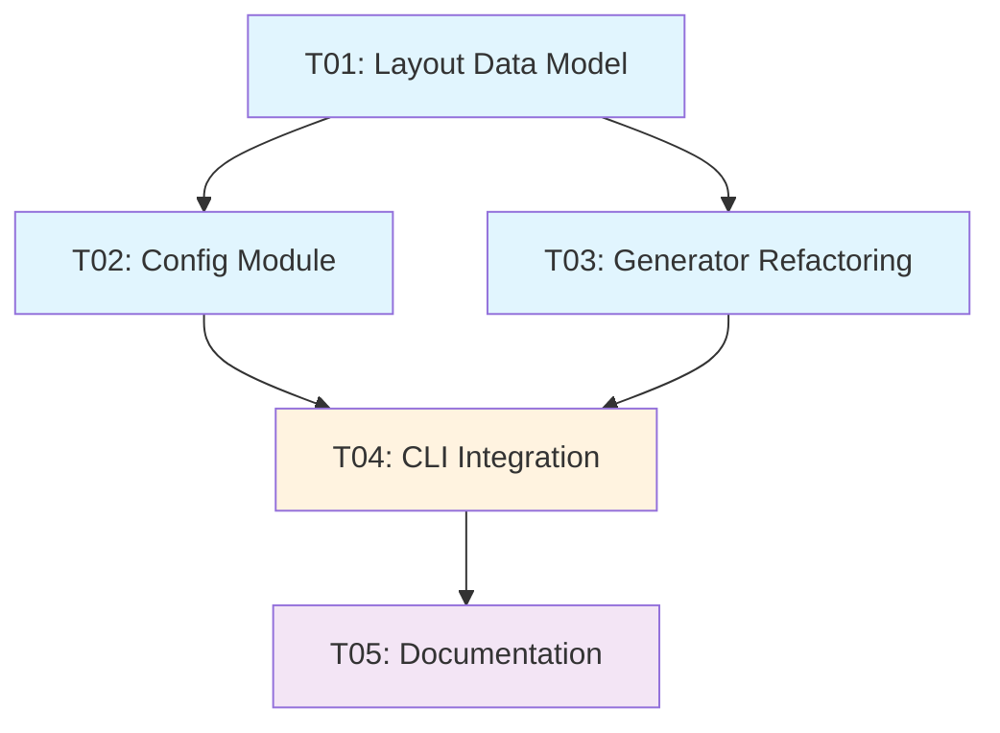

# System Design Document: ar-book-labels Layout Parameterization

## Part A: System Design

### 1. Implementation Approach

#### 1.1 Core Technical Challenges

1. **Grid Auto-calculation**: Given label size, page size, gaps, and margins, automatically calculate the optimal number of columns and rows that maximize label density while respecting spacing constraints.

2. **Internal Coordinate Scaling**: The label's internal elements (badge circle, text positions, line heights) are currently hardcoded for 50x30mm. These must scale proportionally when label size changes, or be independently configurable.

3. **Configuration Layering**: Implement a 3-tier priority system: CLI args > YAML config file > defaults. YAML support must be optional (extra dependency).

4. **Backward Compatibility**: The default behavior (no new args) must produce identical output to the current version.

#### 1.2 Framework and Library Selections

| Library | Purpose | Justification |
|---------|---------|---------------|
| `dataclasses` | Layout class | Python 3.7+ built-in, lightweight, no external dependency |
| `PyYAML` (optional) | YAML config parsing | Standard YAML library, installed as `[yaml]` extra |
| `json` (fallback) | Config parsing without PyYAML | Built-in, zero-dependency fallback |
| `argparse` | CLI parsing | Already in use, no change needed |

#### 1.3 Architecture Pattern

**Layered Architecture** with clear separation:

```
CLI (cli.py)
  ├── Config Loader (config.py) — merge CLI + file + defaults
  └── Layout Builder (layout.py) — compute grid from parameters
        └── Generator (generator.py) — use Layout for SVG generation
```

**Data Flow**:
```
CLI args ─┐
           ├─→ Config Merger ─→ Layout.from_config() ─→ generate() ─→ HTML
YAML file ─┘
```

---

### 2. File List

```
ar-book-labels/
├── ar_book_labels/
│   ├── __init__.py           # UPDATE: export Layout
│   ├── layout.py             # NEW: Layout dataclass + grid computation
│   ├── config.py             # NEW: Config loading + merging
│   ├── generator.py          # MODIFY: Use Layout instead of hardcoded constants
│   ├── cli.py                # MODIFY: Add new CLI args + config loading
│   ├── __main__.py           # NO CHANGE
│   └── templates/
│       └── ar_template.xlsx  # NO CHANGE
├── tests/
│   ├── test_generator.py     # MODIFY: Update for Layout-based API
│   ├── test_layout.py        # NEW: Layout computation tests
│   └── test_config.py        # NEW: Config loading tests
├── docs/
│   ├── system_design.md      # THIS FILE
│   ├── sequence-diagram.mermaid
│   └── class-diagram.mermaid
├── pyproject.toml            # MODIFY: Add pyyaml optional dependency
├── README.md                 # MODIFY: Add TOC + new options docs
├── README.zh.md              # MODIFY: Add TOC + new options docs
└── ar_labels_config.example.yaml  # NEW: Example config file
```

---

### 3. Data Structures and Interfaces

#### 3.1 Layout Class

```python
from dataclasses import dataclass, field
from typing import List, Tuple, Optional

@dataclass
class Layout:
    """Complete layout configuration for AR book labels."""

    # --- Page dimensions (mm) ---
    page_w: float = 210.0      # A4 width
    page_h: float = 297.0      # A4 height

    # --- Label dimensions (mm) ---
    label_w: float = 50.0      # Label width
    label_h: float = 30.0      # Label height
    label_rx: float = 4.0      # Border radius

    # --- Spacing (mm) ---
    col_gap: float = 2.0       # Column gap
    row_gap: float = 0.0       # Row gap
    margin_top: float = 13.5   # Top margin
    margin_left: float = 2.0   # Left margin (auto-calculated if None)

    # --- Typography ---
    font_family: str = "'Segoe UI', system-ui, -apple-system, 'Helvetica Neue', Arial, sans-serif"

    # --- Internal label coordinates (computed from label_w/h) ---
    cx: float = 11.0           # Badge circle center x
    cy: float = 18.0           # Badge circle center y
    cr: float = 6.5            # Badge circle radius
    rx: float = 21.0           # Right text area x start
    vx: float = 34.0           # Value text x (center anchor)
    top_y: float = 4.0         # Top text baseline y
    author_lh: float = 3.2     # Author line height
    title_lh: float = 3.6      # Title line height
    points_y: float = 17.2     # Points row y
    quiz_y: float = 21.7       # Quiz row y

    # --- Computed grid (set by compute_grid) ---
    cols_x: List[float] = field(default_factory=list)
    rows_y: List[float] = field(default_factory=list)
    cols: int = 0
    rows: int = 0
    labels_per_page: int = 0

    def compute_grid(self) -> None:
        """Calculate grid positions from label size and page dimensions."""
        ...

    def compute_internal(self) -> None:
        """Scale internal coordinates proportionally to label size."""
        ...

    @classmethod
    def from_config(cls, config: dict) -> 'Layout':
        """Create Layout from merged config dict."""
        ...

    def to_svg_label(self, book: dict, bw: bool = False,
                     with_border: bool = False) -> str:
        """Generate SVG for a single label using this layout."""
        ...
```

#### 3.2 Config Module

```python
def load_config(path: str) -> dict:
    """Load configuration from YAML or JSON file.

    Returns:
        dict: Configuration values (may be partial).
    """
    ...

def merge_configs(cli_args: dict, file_config: dict,
                  defaults: dict) -> dict:
    """Merge configuration with priority: CLI > file > defaults."""
    ...

def parse_label_size(size_str: str) -> Tuple[float, float]:
    """Parse 'WxH' string into (width, height) tuple."""
    ...

def parse_colors(colors_str: str) -> List[Tuple[float, float, str]]:
    """Parse 'min-max:#HEX,...' into LEVEL_COLORS format."""
    ...
```

#### 3.3 Class Diagram

See `docs/class-diagram.mermaid` for the full class diagram.

---

### 4. Program Call Flow

#### 4.1 Main Generation Flow



#### 4.2 Grid Computation Flow



See `docs/sequence-diagram.mermaid` for the full sequence diagram.

---

### 5. Anything UNCLEAR

#### 5.1 Design Decisions Requiring Confirmation

1. **Internal coordinate scaling strategy**:
   - **Option A (Recommended)**: Proportional scaling based on label_w/h ratio from the default 50x30 baseline. Simple, predictable, works for most sizes.
   - **Option B**: Fully configurable internal coordinates via config file. More flexible but adds complexity.
   - **Decision**: Use Option A as default, with Option B available via config file for power users.

2. **Margin handling**:
   - **Current behavior**: Top margin = 13.5mm (ROWS_Y[0]), left margin = 2mm (COLS_X[0]).
   - **Question**: Should `--margin` apply uniformly to all 4 sides, or should we support `--margin-top`, `--margin-left`, etc.?
   - **Recommendation**: Single `--margin N` for uniform margins, with config file supporting per-side overrides.

3. **Centering labels on page**:
   - **Current behavior**: Labels are left-aligned with fixed 2mm left margin.
   - **Question**: Should labels be centered horizontally/vertically on the page?
   - **Recommendation**: Center horizontally by default (calculate left margin to center the grid), keep top margin as specified.

4. **Font scaling**:
   - **Current behavior**: Font sizes are absolute (e.g., 4.5mm, 5.5mm, 3.2mm).
   - **Question**: Should font sizes scale proportionally with label size?
   - **Recommendation**: Scale proportionally for consistency, with config file override capability.

5. **Preset definitions**:
   - **Question**: Which presets should be included? The PRD mentions `50x30`, `70x37`, `63x38.1` (Avery 5160), `99x38`.
   - **Recommendation**: Include all 4 as built-in presets, plus allow custom `WxH`.

6. **Config file format**:
   - **Question**: Should we support JSON as fallback when PyYAML is not installed?
   - **Recommendation**: Yes, JSON as built-in fallback. YAML requires `pip install ar-book-labels[yaml]`.

#### 5.2 Assumptions Made

1. **Page size remains A4**: The PRD doesn't mention other page sizes. We'll keep A4 as default but make page_w/page_h configurable via config file.

2. **Single-pass generation**: No support for mixed label sizes on the same page. Each generation run uses one Layout.

3. **Color scheme format**: The `--colors` format `"min-max:#HEX,min-max:#HEX,..."` will replace LEVEL_COLORS entirely (no mixing with defaults).

4. **Backward compatibility**: All new parameters are optional. Default behavior (no args) produces identical output to current version.

---

## Part B: Task Decomposition

### 6. Required Packages

```
- pyyaml>=6.0 (optional, for YAML config support)
```

Note: `pyyaml` will be added as an optional dependency under `[yaml]` extra in `pyproject.toml`.

---

### 7. Task List (ordered by dependency)

#### T01: Layout Data Model + Grid Computation
**Task ID**: T01
**Task Name**: Create Layout dataclass with grid auto-calculation
**Source Files**:
- `ar_book_labels/layout.py` (NEW)
- `tests/test_layout.py` (NEW)
**Dependencies**: None
**Priority**: P0

**Description**:
Create the `Layout` dataclass with all layout parameters (page dimensions, label dimensions, spacing, typography, internal coordinates). Implement `compute_grid()` to auto-calculate column/row positions and `labels_per_page`. Implement `compute_internal()` to scale internal coordinates proportionally. Include preset definitions for standard label sizes. Write comprehensive tests for grid computation with various label sizes.

**Key Deliverables**:
- `Layout` dataclass with all fields and defaults
- `compute_grid()` method: calculate COLS_X, ROWS_Y, labels_per_page
- `compute_internal()` method: scale internal coordinates
- `Layout.from_config()` class method
- Preset constants: `PRESET_50x30`, `PRESET_70x37`, `PRESET_63x38`, `PRESET_99x38`
- Test coverage for all presets and custom sizes

---

#### T02: Config Module + YAML Support
**Task ID**: T02
**Task Name**: Create config loading module with YAML/JSON support
**Source Files**:
- `ar_book_labels/config.py` (NEW)
- `ar_labels_config.example.yaml` (NEW)
- `pyproject.toml` (MODIFY - add yaml extra)
- `tests/test_config.py` (NEW)
**Dependencies**: T01
**Priority**: P0

**Description**:
Create the config module that loads configuration from YAML or JSON files. Implement the 3-tier merge logic (CLI > file > defaults). Add helper functions for parsing label size strings and color specifications. Create an example YAML config file. Update `pyproject.toml` to add `pyyaml` as optional dependency. Write tests for config loading, merging, and parsing.

**Key Deliverables**:
- `load_config()`: Load YAML/JSON with graceful fallback
- `merge_configs()`: 3-tier priority merging
- `parse_label_size()`: Parse "WxH" strings
- `parse_colors()`: Parse color specification strings
- Example config file with all options documented
- Test coverage for all config scenarios

---

#### T03: Generator Refactoring
**Task ID**: T03
**Task Name**: Refactor generator.py to use Layout instead of hardcoded constants
**Source Files**:
- `ar_book_labels/generator.py` (MODIFY)
- `tests/test_generator.py` (MODIFY)
**Dependencies**: T01
**Priority**: P0

**Description**:
Refactor `generator.py` to accept a `Layout` instance instead of using hardcoded constants. Update `_generate_label_svg()` to use layout's internal coordinates. Update `build_html()` to use layout's grid positions. Update `generate()` to accept optional `layout` parameter. Maintain backward compatibility: if no layout provided, create default Layout (preserving current behavior). Update existing tests to work with new API.

**Key Deliverables**:
- `_generate_label_svg(book, layout, bw, with_border)`: Use layout for all coordinates
- `build_html(books, layout, ...)`: Use layout for grid positioning
- `generate(..., layout=None)`: Accept optional layout, default to Layout()
- Backward-compatible API (existing calls still work)
- All existing tests pass

---

#### T04: CLI Integration + New Options
**Task ID**: T04
**Task Name**: Add new CLI arguments and config file support
**Source Files**:
- `ar_book_labels/cli.py` (MODIFY)
- `ar_book_labels/__init__.py` (MODIFY)
**Dependencies**: T01, T02, T03
**Priority**: P0

**Description**:
Add all new CLI arguments: `--label-size`, `--col-gap`, `--row-gap`, `--margin`, `--font`, `--radius`, `--colors`, `--config`. Implement the full flow: parse CLI → load config → merge → build Layout → pass to generate. Update `__init__.py` to export Layout. Ensure error handling for invalid inputs (bad label size format, missing config file, etc.).

**Key Deliverables**:
- New CLI arguments with proper help text and validation
- `--config` argument for YAML/JSON config file
- Config merging logic in `main()`
- Layout construction and passing to `generate()`
- Proper error messages for invalid inputs
- Export Layout from `__init__.py`

---

#### T05: Documentation + README Updates
**Task ID**: T05
**Task Name**: Update READMEs with TOC, new options, and examples
**Source Files**:
- `README.md` (MODIFY)
- `README.zh.md` (MODIFY)
**Dependencies**: T04
**Priority**: P1

**Description**:
Add Table of Contents (TOC) to both READMEs using Markdown anchor links. Document all new CLI options with descriptions and examples. Add section for YAML config file usage with example. Update project structure section to include new files. Add preset label size reference table. Ensure both English and Chinese versions are consistent.

**Key Deliverables**:
- TOC with anchor links at top of both READMEs
- New CLI options documented in Options table
- Config file section with example YAML
- Preset sizes reference table
- Updated project structure section
- Consistent EN/ZH documentation

---

### 8. Shared Knowledge

```
- All layout dimensions are in millimeters (mm) for print accuracy
- A4 page size: 210mm x 297mm
- Default label size: 50mm x 30mm (4 cols x 9 rows = 36 per page)
- Internal label coordinates scale proportionally from 50x30 baseline
- Grid calculation: cols = floor((page_w - 2*margin + col_gap) / (label_w + col_gap))
- Grid centering: offset = (available_w - cols*(label_w+col_gap) + col_gap) / 2
- Color scheme format: "min-max:#HEX,min-max:#HEX,..." replaces LEVEL_COLORS
- Config priority: CLI args > YAML file > defaults
- YAML is optional dependency: pip install ar-book-labels[yaml]
- JSON is built-in fallback when PyYAML not installed
- Backward compatibility: no new args = identical output to v0.1.3
```

---

### 9. Task Dependency Graph



**Legend**:
- Blue (T01-T03): Core implementation tasks
- Orange (T04): Integration task
- Purple (T05): Documentation task

---

## Appendix: Preset Definitions

### Standard Label Size Presets

| Preset Name | Dimensions (WxH) | Cols | Rows | Labels/Page | Margin Top | Margin Left | Notes |
|-------------|------------------|------|------|-------------|------------|-------------|-------|
| `50x30` (default) | 50mm x 30mm | 4 | 9 | 36 | 13.5mm | 2mm | Current default, Avery 5160 compatible |
| `70x37` | 70mm x 37mm | 3 | 7 | 21 | 14mm | 7.5mm | Larger labels, fewer per page |
| `63x38.1` | 63mm x 38.1mm | 3 | 7 | 21 | 11.45mm | 10.5mm | Avery 5160 US Letter |
| `99x38` | 99mm x 38mm | 2 | 7 | 14 | 14.5mm | 6mm | Extra large labels |

### Grid Calculation Formula

```
available_w = page_w - 2 * margin_left
available_h = page_h - 2 * margin_top

cols = floor((available_w + col_gap) / (label_w + col_gap))
rows = floor((available_h + row_gap) / (label_h + row_gap))

center_offset_x = (available_w - cols * (label_w + col_gap) + col_gap) / 2

COLS_X[i] = margin_left + center_offset_x + i * (label_w + col_gap)
ROWS_Y[j] = margin_top + j * (label_h + row_gap)

labels_per_page = cols * rows
```

### Internal Coordinate Scaling

All internal coordinates scale proportionally from the 50x30mm baseline:

```
scale_x = label_w / 50.0
scale_y = label_h / 30.0

CX = 11.0 * scale_x
CY = 18.0 * scale_y
CR = 6.5 * ((scale_x + scale_y) / 2)  # Average scale for radius
RX = 21.0 * scale_x
VX = 34.0 * scale_x
TOP_Y = 4.0 * scale_y
AUTHOR_LH = 3.2 * scale_y
TITLE_LH = 3.6 * scale_y
POINTS_Y = 17.2 * scale_y
QUIZ_Y = 21.7 * scale_y
```
